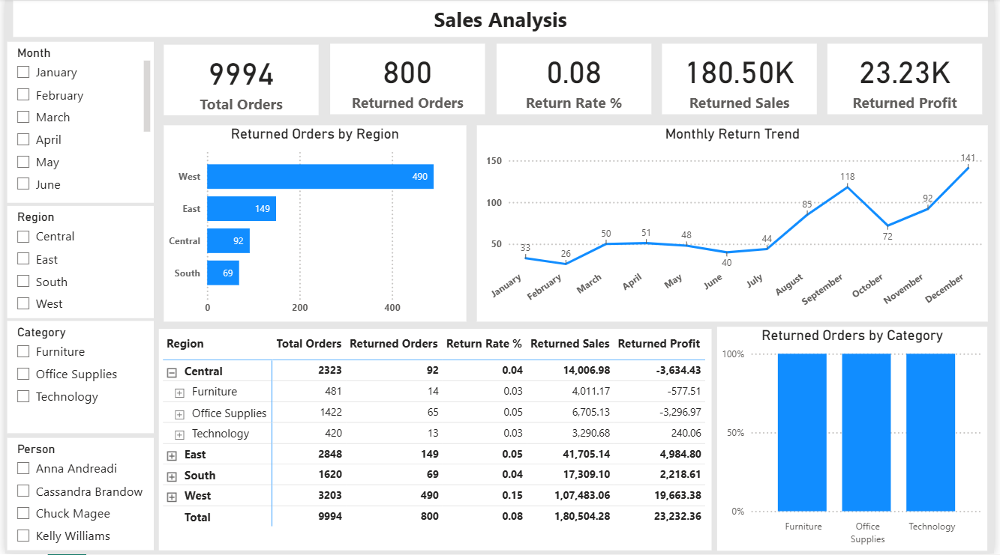

# 📊 Sales Return Analysis Dashboard

## 📝 Project Overview

An interactive Power BI dashboard analyzing ~10K orders to uncover return trends by region and category. Utilizes DAX and Power Query for dynamic KPIs and actionable insights.

## 🚀 Features

- Dynamic KPIs: Total Orders, Return Rate %, Returned Sales & Profit.
- Monthly return trends visualization.
- Breakdown of returned orders by region and category.
- Interactive filters for Month, Region, Category, and Salesperson.
- Summary table with detailed return metrics.

## 🛠️ Technologies Used

- Power BI Desktop
- Power Query Editor
- DAX (Data Analysis Expressions)

## 📂 File

- `Sales_Return_Analysis.pbix` – Power BI dashboard file.

## 📸 Dashboard Preview

## 📈 How to Use

1. Download the `.pbix` file.
2. Open it using Power BI Desktop.
3. Interact with the dashboard using the provided filters and visuals.

## 👤 Author

- **Name**: Rupa
- **GitHub**: [Your GitHub Profile](https://github.com/yourusername)
